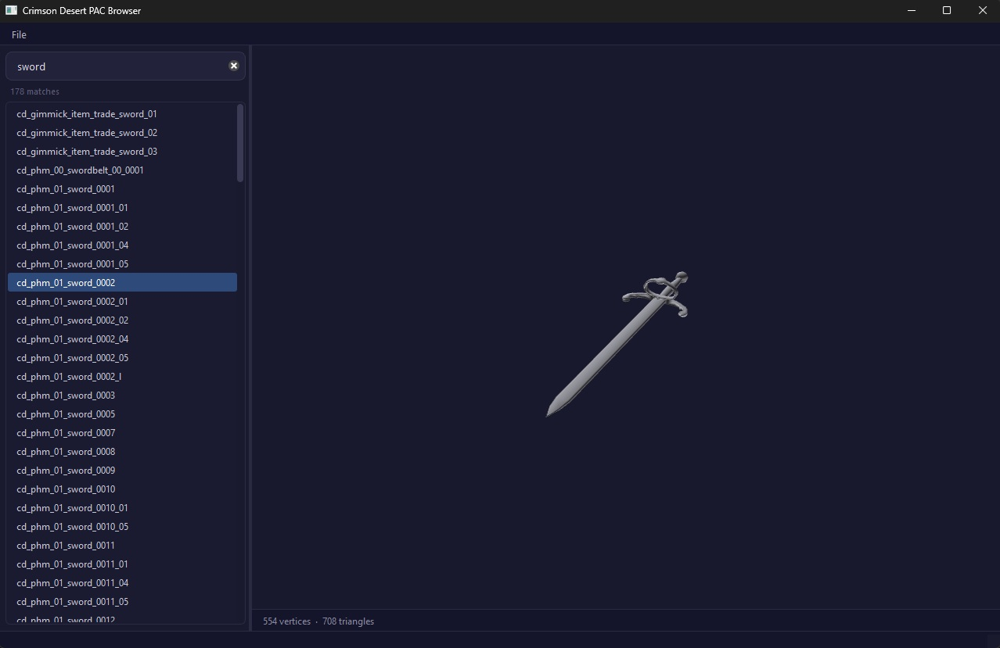
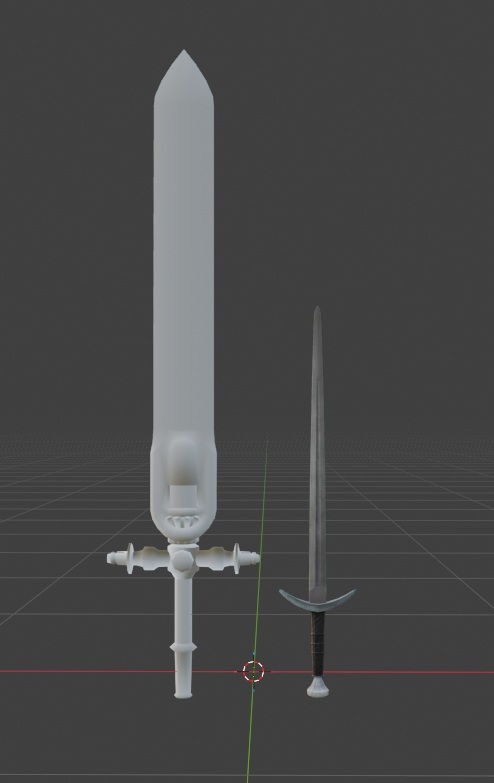

# Crimson Desert Model Browser

### Export models from Crimson Desert to Blender

A desktop tool for browsing, previewing, and exporting 3D models from Crimson Desert game archives.

Reads PAC mesh files directly from the game's PAZ archives, displays them in an interactive 3D viewer, and exports to OBJ + MTL with DDS textures for use in **Blender**.


---

## Table of Contents

- [Features](#features)
- [Requirements](#requirements)
- [Quick Start](#quick-start)
- [Usage](#usage)
  - [GUI Browser](#gui-browser)
  - [Command-line Export](#command-line-export)
  - [Tests](#tests)
- [How It Works](#how-it-works)
- [Known Limitations](#known-limitations)
- [Acknowledgments](#acknowledgments)

---

## Features

- **Model browser** - searchable list of all PAC files in the game (12,000+ models)
- **3D preview** - real-time OpenGL viewer with orbit camera (rotate, pan, zoom)
- **OBJ + MTL export** - full geometry with material references and DDS textures


## Requirements

- Python 3.10 or newer
- Crimson Desert installed (needs access to game archives in `0009/`)
- [lazorr410/crimson-desert-unpacker](https://github.com/lazorr410/crimson-desert-unpacker) (included as git submodule)

## Quick Start


```bash
git clone --recursive https://github.com/Altair200333/CrimsonDesertPacBrowser.git
cd CrimsonDesertPacBrowser
```


```bash
pip install -r requirements.txt
```

Run it

```bash
python src/pac_browser.py
```

On first launch select Crimson Desert installation folder.

---


### GUI Browser

```bash
python src/pac_browser.py
```

The left panel shows all PAC models from the game. Type in the search bar to filter by name. Click a model to load it in the 3D viewer.

Search the model or select it, then click File -> Export to export as obj file with textures

<p>
  
  
</p>

### Command-line Export

For scripting use `pac_export.py` directly:

```bash
python src/pac_export.py path/to/model.pac -o output_folder
```

### Tests

```bash
python tests/test_pac.py
```

Runs 19 tests that validate geometry parsing against known-good models. Requires access to the game archives.

---

## How It Works

PAC files store skinned meshes used for characters, armor, and weapons. Each file contains:

- **Section 0** -- metadata: mesh names, material names, bounding boxes, bone references
- **Sections 1-4** -- LOD geometry (low to high detail), with vertices and indices in a combined buffer

Vertex format is 40 bytes per vertex: quantized position (uint16 x3), UVs (float16 x2), normals (R10G10B10A2), bone indices, and bone weights. Positions are dequantized using per-mesh center and half-extent values stored in the mesh descriptor.

The tool reads these directly from PAZ archives using the PAMT file index, decompresses type 1 sections (per-section LZ4), and reconstructs the mesh geometry.

## Known Limitations

- About 2% of models with secondary physics data may show a few stange intralinked triangles
- No rigging or bone hierarchy export yet
- No write-back (though it is possible and will be added soon)

## Dependencies

- [lazorr410/crimson-desert-unpacker](https://github.com/lazorr410/crimson-desert-unpacker) - PAZ archive parser and unpacker
